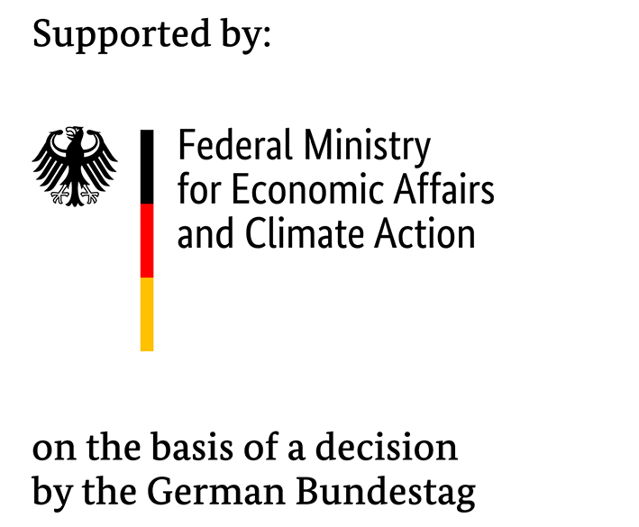

# 3DCityDB with EnergyADE and UtilityNetworksADE for Django

## Introduction

The `django-citydb` application is an interface to 3DCityDB with extensions of EnergyADE and UtilityNetworksADE. We are schema-compliant
with 3DCityDB and ADEs, however we have not connected all possible classes of EnergyADE and UtilityNetworksADE schema.

In addition this app will offer Django templates and static Java scripts that can be
used for a GIS based web application with various pre-defined functions. Feel
free to use and change them for you specific project.

To run this app you'll have to have access to a `PostGIS PostgreSQL` and `InfluxDB`
database, we assume that you'll set up Django project and a python environment with
dependencies and corresponding environment variables. As a template you can use
[vDistrict](https://git.rwth-aachen.de/EBC/Team_UES/living-roadmap/vDistrict?nav_source=navbar), where you'll also find detailed instructions for isntallation of
databases and your python environment.

This application is developed by `Team UES`, if you have any questions don't hesitate to
contact [us](mailto:PRemmen@eonerc.rwth-aachen.de). The application is explicitly
developed to be used in as many `Team UES` projects as possible. The goal is to publish
it as open-source software.

## Install python package `django-citydb` and its dependencies

To install the `django-citydb` package itself do the following:

- Clone this repository into your desired folder:

        $ git clone [SSH-Key/Https]

- Use pip to install the local copy of `django-citydb` (the path should point to the folder that contains this `README`):

        $ pip install -e [Path/to/your/django-citydb/Clone]

## Quick start to use `django-citydb` in your personal Django project

We assume you have followed installation instructions above (including setting
up the databases or having databases available).

Run to create and synchronize the models (after the first `migrate` you will
    get some errors, that the table `building` already exists, please just ignore it)

        $ python manage.py migrate citydb
        $ python manage.py migrate --fake-initial

## Version

This is version 0.1.0

## Schema changes to CityGML EnergyADE

We aim at full schema conformability wit EnergyADE for CityGML. However, 
we made some changes, we try to add schema conformability in future:

- add "provides" to all EnergyConversionSystem to easily link Systems to buildings that are provided with this system (see: https://git.rwth-aachen.de/energyade/citygml-energy/issues/168)
- add "series_related_to" to IrregularTimeSeriesFile to easily link more than one time series to EnergyConversionSystems (issue to be raised)
- add "ordered_position" to Layer, to order the position of the layer from inside to outside

## How to contribute?

Thanks for contributing! Please follow our [contributors guide](./docs/contributor.md)

## Reference 

The actual main part of 'django-citydb' is developed for: 

    (1) Remmen, P. Automated Calibration of Non-Residential Urban Building Energy Modeling = Automatisierte Kalibrierung von Simulationsmodellen Für Nichtwohngebäude Im Städtischen Maßstab, 1. Auflage.; E.ON Energy Research Center, RWTH Aachen University: Aachen, 2022. [Link](https://publications.rwth-aachen.de/record/843586/files/843586.pdf)

Current status of the code will be updated continously. List of publications:

- [GityGML Import and Export for Dynamic Building Perfomance Simulation](https://www.researchgate.net/publication/308368722_CityGML_Import_and_Export_for_Dynamic_Building_Performance_Simulation_in_Modelica)  

## Contact 

Code is maintained by TU Berlin Institute for Digital Networking of Buildings, Energy Supply Systems and Users. [Contact Us](mailto:info@dvg.tu-berlin.de)

## License

[MIT](LICENSE)

## Acknowledgements

`django-citydb` has been developed within public funded projects
and with financial support by BMWK (Federal Ministry for Economics and Climate Action)

